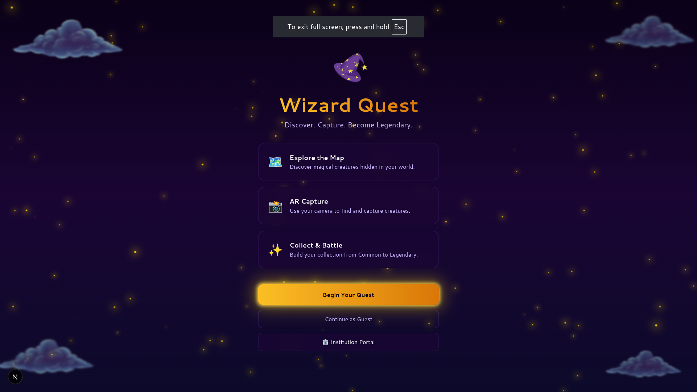
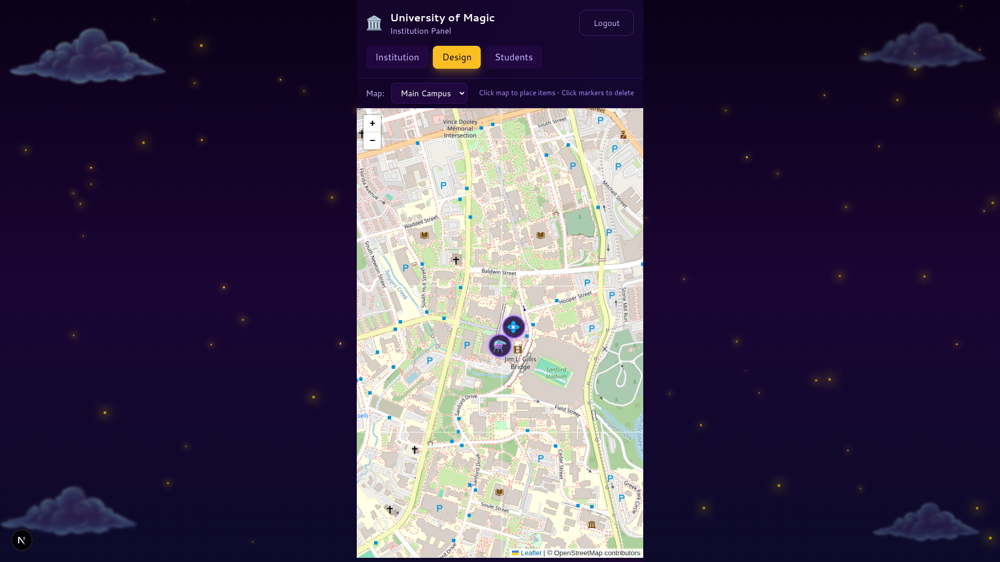
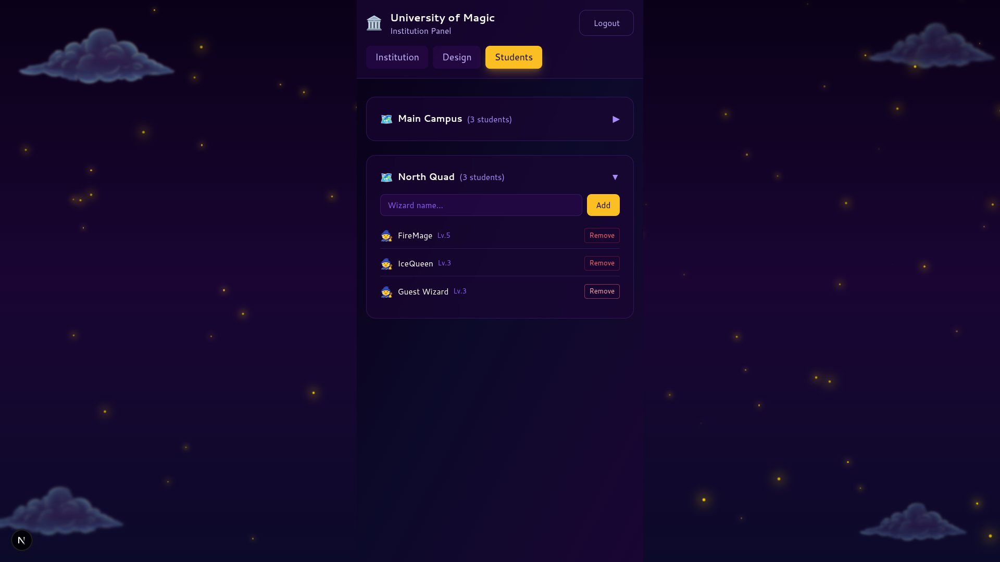
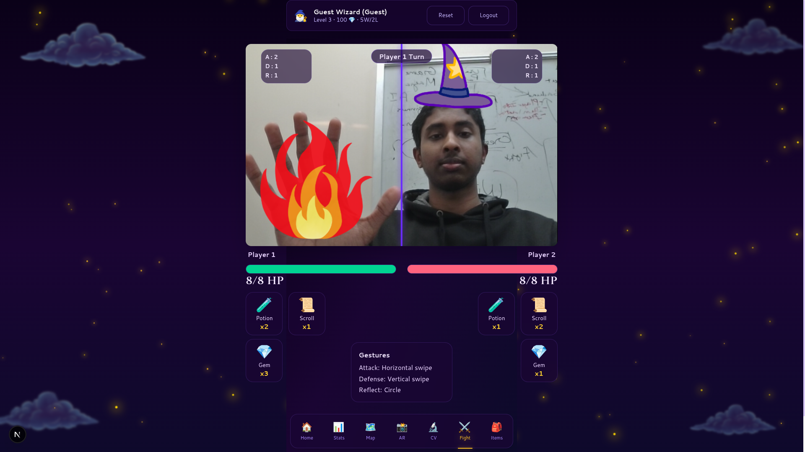
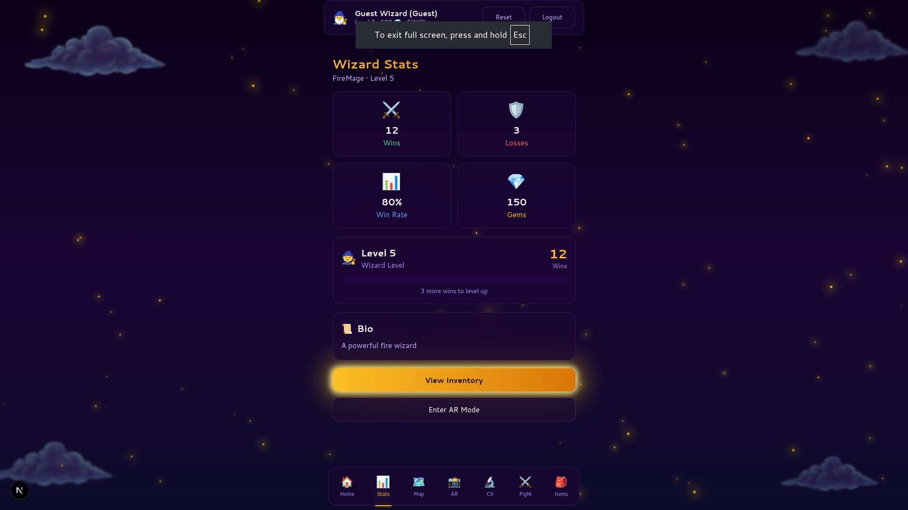
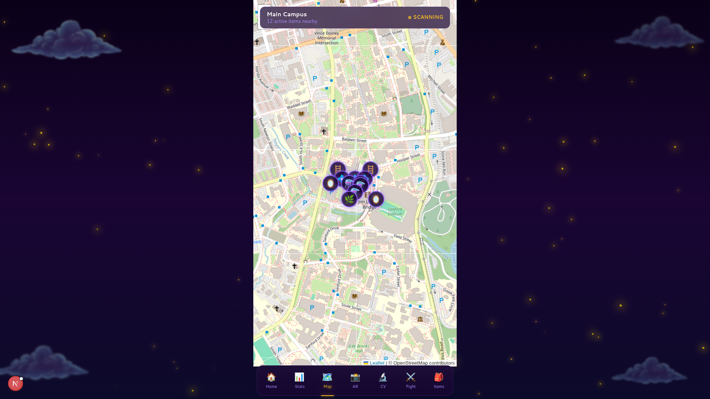
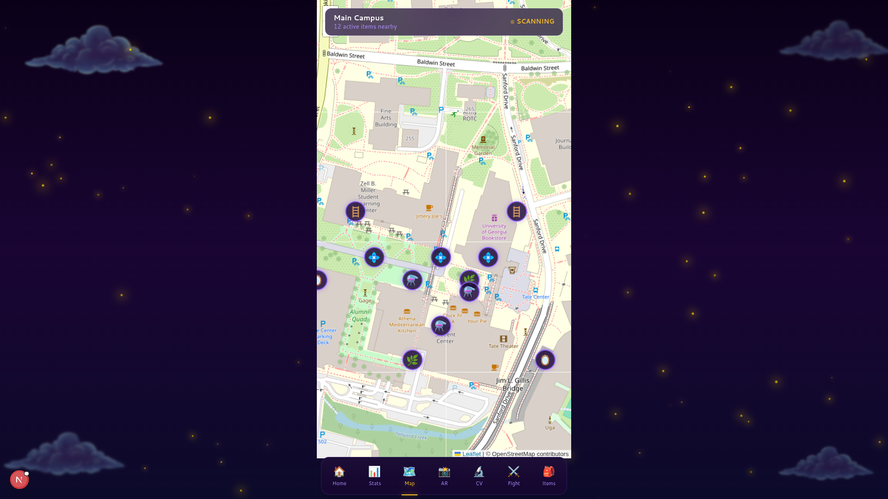

# Wizard Quest 🧙‍♂️

A magical location-based AR combat game where wizards battle for supremacy on college campuses! Cast spells, collect magical items, and dominate the leaderboard in this immersive augmented reality experience.

## 🌐 Live Demo

**Try Wizard Quest Now**: [https://discerning-protonematal-jetta.ngrok-free.dev](https://discerning-protonematal-jetta.ngrok-free.dev)

*Experience the magic directly in your browser - no installation required!*

⚠️ **Note**: For the best experience, use a mobile device with GPS and camera capabilities to enable AR features and location-based gameplay.

## 🎮 Features

### Core Gameplay
- **Location-Based Combat**: Real-world GPS positioning for strategic battles
- **AR Spell Casting**: Hand gesture recognition for authentic wizard combat
- **Item Collection**: Discover potions, gems, wands, and scrolls across campus
- **Multiplayer Battles**: Challenge other wizards in real-time combat
- **Institution Management**: Design and manage magical territories

### Game Modes
- **Guest Mode**: Jump in instantly and start your magical journey
- **Student Mode**: Create your wizard profile and track progress
- **Institution Mode**: Design maps, place items, and manage student access
- **AR Mode**: Full augmented reality experience with device orientation
- **CV Mode**: Computer vision hand tracking for spell casting

## 🏗️ Architecture

### Frontend (Next.js + TypeScript)
- **Modern React**: Next.js 16 with TypeScript
- **Motion Graphics**: Framer Motion for smooth animations
- **AR Support**: WebXR, AR.js, and custom AR rendering
- **Map Integration**: Leaflet with custom magical tile layers
- **Real-time Updates**: WebSocket connections for live gameplay

### Backend (FastAPI + PostgreSQL)
- **Python API**: FastAPI with async/await
- **Geospatial Database**: PostgreSQL with PostGIS
- **Authentication**: JWT tokens and guest sessions
- **Location Services**: Real-time GPS tracking and proximity detection
- **Battle Engine**: Turn-based combat system

### Database Schema
```sql
institutions → maps → items
    ↓           ↓       ↓
  profiles → map_access → battle_logs
```

## 🚀 Quick Start

### 🌐 Try It Live First
**No installation required!** Experience Wizard Quest immediately:
[https://discerning-protonematal-jetta.ngrok-free.dev](https://discerning-protonematal-jetta.ngrok-free.dev)

### Local Development Setup
If you want to run Wizard Quest locally:

#### Prerequisites
- Node.js 18+
- Python 3.8+
- PostgreSQL with PostGIS extension
- Mobile device with camera and GPS (for AR features)

#### Installation

1. **Clone the repository**
```bash
git clone <repository-url>
cd ugahacks-11
```

2. **Install Frontend Dependencies**
```bash
cd frontend
npm install
```

3. **Install Backend Dependencies**
```bash
cd backend
pip install -r requirements.txt
```

4. **Setup Database**
```bash
# Create PostgreSQL database with PostGIS
createdb wizard_quest

# Run database initialization
psql wizard_quest < backend/db-init/01_init.sql
psql wizard_quest < backend/db-init/02_mock_data.sql
psql wizard_quest < backend/db-init/03_guest_user.sql
psql wizard_quest < backend/db-init/04_fix_mock_items.sql
psql wizard_quest < backend/db-init/05_map_access.sql
```

5. **Start Development Servers**
```bash
# Backend (port 8000)
cd backend
uvicorn main:app --host 0.0.0.0 --port 8000 --reload

# Frontend (port 3000)
cd frontend
npm run dev
```

6. **Access the Application**
- **🌐 Live Demo**: https://discerning-protonematal-jetta.ngrok-free.dev
- **🏠 Local Game**: http://localhost:3000
- **🏫 Institution Portal**: http://localhost:3000/institution/login
- **📚 API Documentation**: http://localhost:8000/docs

## 🎯 Gameplay Overview

### Getting Started
1. **Choose Your Path**: Play as guest or create a wizard profile
2. **Explore Campus**: Move around to discover magical items
3. **Learn Spells**: Master hand gestures for powerful incantations
4. **Battle Rivals**: Challenge nearby wizards for magical supremacy
5. **Join Institution**: Connect with your school's magical community

### Combat System
- **Hand Gesture Spells**: Draw patterns in the air to cast spells
- **Elemental Magic**: Attack, defense, and reflection spells
- **Strategic Positioning**: Use terrain to your advantage
- **Power-ups**: Collect items for temporary boosts
- **Leaderboard Rankings**: Climb the ranks of powerful wizards

### Item Collection
- **Potions**: Temporary buffs and healing
- **Gems**: Power crystals for spell enhancement
- **Wands**: Magical instruments for casting
- **Scrolls**: Ancient spells and knowledge
- **Chests**: Treasure boxes with random rewards

## 📱 Screenshots

### Main Game Interface

*The magical campus map with real-time item locations*

### Spell Casting Interface

*Computer vision hand tracking for authentic spell casting*

### AR Battle Mode

*Augmented reality combat with magical effects*

### Item Collection

*Discover and collect magical items across campus*

### Battle Arena

*Intense wizard battles with particle effects*

### Institution Dashboard

*Manage maps and items for your magical institution*

### AR Map View

*See the magical world through AR glasses*

### Inventory Management

*Organize your magical items and equipment*

### Multiplayer Combat

*Challenge other wizards in real-time battles*

## 🏫 Institution Features

### Map Design
- **Custom Territories**: Design magical maps for your institution
- **Item Placement**: Strategically place potions, gems, and treasures
- **Student Access**: Grant access to specific students or groups
- **Analytics**: Track engagement and activity

### Student Management
- **Access Control**: Manage who can access your magical maps
- **Progress Tracking**: Monitor student advancement
- **Battle Records**: View combat history and achievements

## 🔧 Technical Features

### Real-time Geolocation
- **GPS Integration**: Accurate positioning for gameplay
- **Proximity Detection**: Find nearby players and items within range
- **Geofencing**: Define magical boundaries and territories

### Computer Vision
- **Hand Tracking**: MediaPipe for gesture recognition
- **Pattern Recognition**: Identify spell casting movements
- **AR Integration**: Overlay magical effects on real world

### Performance Optimizations
- **Lazy Loading**: Efficient map tile and asset loading
- **Caching**: Smart caching for faster response times
- **Optimized Rendering**: Smooth animations and transitions

## 🧪 Development

### Environment Setup
```bash
# Frontend
cd frontend
npm run dev          # Development server
npm run build        # Production build
npm run lint         # Code linting
npm run type-check   # TypeScript checking

# Backend
cd backend
uvicorn main:app    # Development server
pytest              # Run tests
```

### API Endpoints

#### Authentication
- `POST /api/auth/guest/login` - Guest user login
- `POST /api/auth/user/login` - User login
- `POST /api/auth/user/login` - User registration

#### Players
- `GET /api/player/{id}` - Get player profile
- `GET /api/player/{id}/inventory` - Get player items
- `GET /api/player/{id}/maps` - Get player maps
- `PATCH /api/player/sync` - Update player location

#### Items
- `GET /api/map/{id}/proximity` - Get nearby items
- `POST /api/items/collect` - Collect an item
- `POST /api/items/use` - Use an item
- `POST /api/items/spawn` - Spawn new item

#### Institutions
- `POST /api/institution/login` - Institution login
- `GET /api/institution/{id}/maps` - Get institution maps
- `POST /api/institution/{id}/items` - Create items
- `GET /api/institution/{id}/students` - Get students

### Database Schema
```sql
-- Core tables
institutions (id, name, password_hash)
maps (id, name, institution_id)  
profiles (id, name, level, wins, losses, gems, location)
items (id, type, subtype, owner_id, map_id, location, expires_at)
battle_logs (id, attacker_id, defender_id, winner_id, created_at)

-- Access control
map_access (profile_id, map_id, granted_at)

-- Geographic indexes
CREATE INDEX idx_items_location ON items USING GIST(location);
CREATE INDEX idx_profiles_location ON profiles USING GIST(location);
```

## 🎨 Customization

### Map Styling
- **Custom Tiles**: Magical theme with spell effects
- **Particle Systems**: Dynamic visual effects
- **Day/Night Cycle**: Time-based appearance changes

### Item System
- **Custom Items**: Define new magical artifacts
- **Rarity System**: Common, rare, epic, legendary items
- **Special Effects**: Particle animations and sound effects

## 🔒 Security

### Authentication
- **JWT Tokens**: Secure session management
- **Guest Sessions**: Temporary access without registration
- **Institution Login**: School-specific authentication

### Data Protection
- **Location Privacy**: Configurable GPS accuracy
- **Data Encryption**: Secure communication protocols
- **Access Control**: Role-based permissions

## 🚀 Deployment

### Docker Setup
```dockerfile
# Frontend Dockerfile
FROM node:18-alpine
WORKDIR /app
COPY package*.json ./
RUN npm ci --only=production
COPY . .
EXPOSE 3000
CMD ["npm", "start"]
```

### Production Environment
```bash
# Backend deployment
docker-compose up -d

# Frontend build
npm run build
npm run start
```

## 📊 Performance

### Metrics
- **Response Time**: <200ms for API calls
- **GPS Accuracy**: Within 5 meters
- **AR FPS**: 30-60 FPS on modern devices
- **Concurrent Users**: 1000+ simultaneous players

### Optimization Techniques
- **Database Indexing**: Optimized geospatial queries
- **Caching Layer**: Redis for frequently accessed data
- **CDN**: Static asset delivery
- **Load Balancing**: Multiple backend instances

## 🤝 Contributing

### Development Workflow
1. Fork the repository
2. Create feature branch: `git checkout -b feature/magical-feature`
3. Commit changes: `git commit -m 'Add magical spell casting'`
4. Push branch: `git push origin feature/magical-feature`
5. Submit Pull Request

### Code Standards
- **TypeScript**: Strong typing throughout
- **ESLint**: Consistent code formatting
- **Prettier**: Automated code styling
- **Tests**: Unit tests for all features

## 📄 License

MIT License - see LICENSE file for details

## 🙏 Acknowledgments

### Technologies Used
- **Frontend**: Next.js, React, TypeScript, Tailwind CSS, Framer Motion
- **Backend**: FastAPI, Python, PostgreSQL, PostGIS
- **AR/VR**: WebXR, AR.js, Three.js, MediaPipe
- **Maps**: Leaflet, OpenStreetMap

### Libraries & APIs
- **Animation**: Framer Motion, GSAP
- **Geolocation**: Browser Geolocation API
- **Camera**: WebRTC, MediaDevices API
- **Storage**: IndexedDB, LocalStorage

---

**Wizard Quest** - Where Magic Meets Reality! 🪄✨

*Built with ❤️ by the UGA Hacks team*